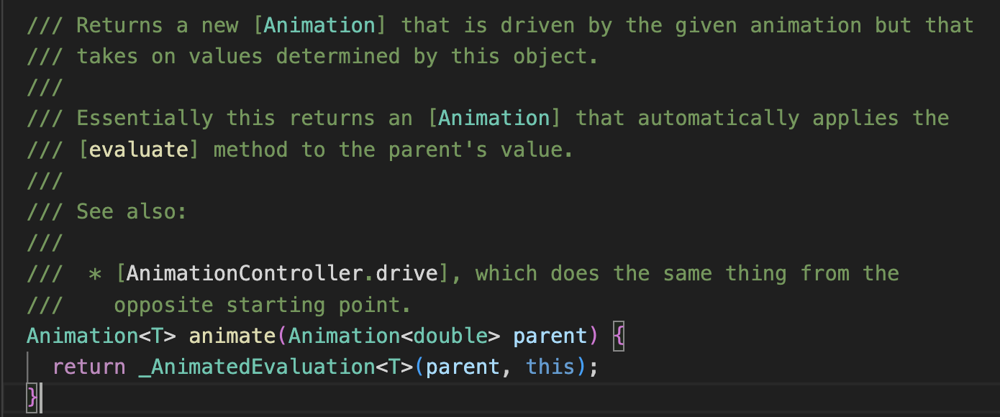

# Animation

这两天在看Flutter中动画部分，基本就是过了一遍《Flutter实战第二版》中的动画章节 + 拷打GPT。

动画都是一个值的差值变化+渲染。

Flutter中的动画和RN中的比较像：

1.都有一个保存动画差值的AnimationValue对象。RN是Animated.Value，Flutter是Animation直接保存

2.都有一个包装好差值监听并刷新的View。

RN是Animated.view或者Animated.Image这种监听了props中的AnimatedValue，然后变更时进行Render重绘。

在Flutter承担这个角色的是AnimatedWidget，接受一个Listenable对象（Animation继承自Listenable），在变更时候去修改状态机然后触发build重绘。

区别：

1.RN中通过Animated.timing这种方法创建带有差值变化的Animation。

Flutter通过Tween或者TweenSequence的animate方法创建描述差值的Animation。

（TweenSequence类似iOS原生中的关键帧动画）

2.RN中执行动画也是通过Animated，而在Flutter中执行动画等控制拆出来了一个AnimationController。

## 1.Animation

### 1.1Animation & AnimationController

一个简单的平移动画，在Flutter中是这样的：

```dart
import 'package:flutter/material.dart';

class MoveAnimationPage extends StatefulWidget {
  const MoveAnimationPage({super.key});
  @override
  State<MoveAnimationPage> createState() => _AnimationPageState();
}

class _AnimationPageState extends State<MoveAnimationPage> with SingleTickerProviderStateMixin {
  late Animation<double> animation;
  late AnimationController controller;

  @override
  void initState() {
    super.initState();
    controller = AnimationController(vsync: this,duration: const Duration(milliseconds: 500));
    animation = Tween(begin: 0.0,end: 375.0 - 60).animate(CurvedAnimation(parent: controller, curve: Curves.linear))
    ..addListener(() {
      setState(() {
        
      });
    });
  }

  @override
  Widget build(BuildContext context) {
    return Scaffold(
      appBar: AppBar(
        title: const Text('Animation'),
      ),
      body: Stack(
        children: [
          Positioned(
              top: 20,
              left: animation.value,
              child: GestureDetector(
                onTap: () {
                  controller.forward();
                },
                child: Container(
                    decoration: BoxDecoration(borderRadius: BorderRadius.circular(30),color: Colors.orange),
                    width: 60,
                    height: 60
                  ),
              ),
            )
        ],
      ),
      );
  }

  @override
  void dispose() {
    controller.dispose();
    super.dispose();
  }
}
```

<b>addListener</b>
监听动画的差值变化，刷新状态机，进而触发build重绘。
<b>animate</b>
有一点比较特殊，创建动画对象时，是先创建一个Tween对象，设置了起点终点值。
对该Tween对象调用了animate方法，传入了一个线性渐变的CurvedAnimation对象。

animate看描述像是一个合并两个Animation到一起的方法，使用当时对象的值，使用入参的动画效果，返回一个新的动画对象：

像是胶水一样把描述起点/终点值的动画对象，和描述变化点动画对象粘在一起。

<b>addStatusListener</b>
可以拿到动画的状态


### 1.4 AnimationController

## 2.Custom